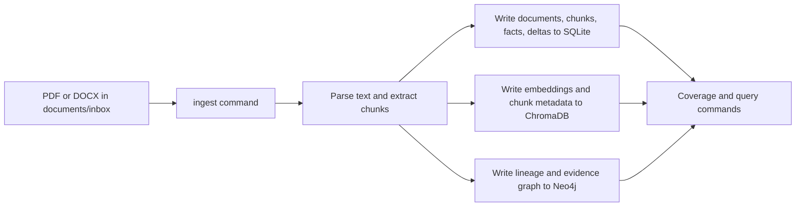

# Multi-Agentic-RAG

Multi-Agentic-RAG is a local-first, version-aware RAG ingestion project for engineering documents. The default runtime uses SQLite for metadata, ChromaDB for vectors, and local Neo4j for graph storage. HuggingFace embeddings and reranking remain the default model-backed path, while PostgreSQL and Weaviate stay available only through explicit managed-target configuration.

## Local Defaults

- `MULTI_AGENTIC_RAG_PROFILE=local`
- `MARAG_TARGET_MODE=local`
- `ALLOW_LOCAL_DEV_MODE=true`
- `REGISTRY_PROVIDER=sqlite`
- `VECTOR_STORE_PROVIDER=chroma`
- `LLM_PROVIDER=none`
- `GRAPHRAG_REQUIRED=true`
- `NEO4J_URI=bolt://127.0.0.1:7687`

## Quick Start

1. Create and activate a Python 3.12 virtual environment.
2. Install dependencies with `uv sync --locked`.
3. Copy `.env.example` to `.env` and set the local Neo4j password and helper paths.
4. Run `uv run multi-agentic-rag doctor`.
5. Ingest the V1 document, then ingest V2.

See [SETUP.md](SETUP.md) for the full setup sequence and [ingest.md](ingest.md) for the internal ingestion flow.

## Storage Responsibilities

| Layer | Local default | Responsibility |
| --- | --- | --- |
| Metadata | SQLite | Documents, chunks, facts, deltas, coverage, and execution results |
| Vectors | ChromaDB | Persistent chunk embeddings and similarity search |
| Graph | Neo4j | Requirement lineage, document relationships, and graph-backed retrieval |

SQLite and Chroma are intentionally local-only unless `ALLOW_LOCAL_DEV_MODE=true` is set.

## Local Workflow



## Ingestion Commands

```bash
uv run multi-agentic-rag ingest documents/inbox/PROJECT_1/SIIMCS_BRD_V1.pdf --system PROJECT_1 --version v1
uv run multi-agentic-rag ingest documents/inbox/PROJECT_1/SIIMCS_BRD_V2.pdf --system PROJECT_1 --version v2
```

The V2 ingest supersedes the active V1 document, records deltas, refreshes the graph, and updates the tracked runtime evidence.

## Verification

```bash
uv run multi-agentic-rag doctor --system PROJECT_1 --version v1
uv run multi-agentic-rag graph-check
```

SQLite:

```sql
SELECT document_id, source_name, version, status FROM documents ORDER BY created_at DESC;
SELECT fact_key, value, version FROM facts WHERE system_name = 'PROJECT_1' ORDER BY created_at DESC;
SELECT change_type, fact_key, from_version, to_version FROM deltas WHERE system_name = 'PROJECT_1';
```

Neo4j:

```cypher
MATCH (d:Document {system_name: "PROJECT_1"}) RETURN d.document_id, d.version, d.status;
MATCH (c:Chunk {system_name: "PROJECT_1"}) RETURN count(c);
MATCH (f:Fact {system_name: "PROJECT_1"}) RETURN f.fact_key, f.value, f.version;
```

## Managed Target Mode

Managed target mode remains supported for PostgreSQL, Weaviate, OpenAI, and target GraphRAG environments. Set `MARAG_TARGET_MODE=target-graphrag` and override the managed services explicitly in `.env` when you want that posture.
