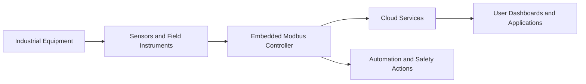

# Smart Industrial IoT Monitoring & Control System Using Modbus Controller

## 1. Executive Summary

The Smart Industrial IoT Monitoring & Control System (SIIMCS) is a cloud-connected industrial monitoring and control solution.

SIIMCS uses an embedded controller to collect operating data from industrial sensors and field instruments through a Modbus communication interface. The system supports real-time monitoring, threshold-based alerts, rule-based control, cloud reporting, and maintenance planning.

The objective of this BRD version is to keep the requirements short, clear, reviewable, and executable for stakeholders.

---

## 2. Business Objectives

| Objective | Description |
|---|---|
| Real-Time Monitoring | Collect and present current operating data from industrial equipment. |
| Rule-Based Control | Trigger predefined actions when operating conditions cross approved limits. |
| Alerts and Response | Notify responsible teams when sensor values require attention. |
| Integration | Share data with cloud platforms, dashboards, APIs, and enterprise systems. |
| Reliability | Continue safe monitoring during sensor, controller, or connectivity issues. |
| Maintenance Support | Use historical readings, operating history, and equipment condition changes to plan maintenance and reduce unplanned downtime. |

---

## 3. Business Scope

### 3.1 In Scope

- Controller-based polling of three configured sensors or field instruments.
- Collection of temperature, vibration, gas, pressure, or equivalent industrial readings.
- Cloud-based storage and monitoring.
- User-facing dashboards and operational interfaces.
- Alert and escalation workflows.
- Rule-based automation for safety and efficiency.
- REST API integration with third-party systems.
- Local data storage on the controller during internet outage.
- Synchronization of locally stored data after connectivity returns.
- Sensor and controller health visibility.

### 3.2 Out of Scope

- Manufacturing physical sensors.
- Full SCADA replacement.
- On-premises-only deployment in the initial phase.
- Custom AI model training beyond predefined industrial parameters.
- Manual calibration workflow design.
- Custom hardware design for every industrial machine.

---

## 4. Stakeholders

| Stakeholder | Responsibility |
|---|---|
| Client Organization | Owns business goals, priorities, and acceptance decisions. |
| IT and Engineering Teams | Implement controller, cloud, interfaces, and integrations. |
| Operations Managers | Monitor equipment status, alerts, and response actions. |
| Maintenance Teams | Use equipment condition data to plan service activity. |
| Safety Teams | Define critical limits and emergency actions. |
| Third-Party Integrators | Connect SIIMCS with external enterprise systems. |
| QA and Validation Teams | Validate workflows, alerts, controls, and reliability scenarios. |

---

## 5. System Overview

SIIMCS consists of:

- Industrial equipment being monitored.
- Sensors or field instruments connected to equipment.
- Embedded controller that reads sensor data using Modbus.
- Cloud services for storage, analytics, alerts, and reporting.
- User-facing dashboards and applications.
- REST APIs for enterprise integration.
- Actuators for approved automation and safety actions.

The controller acts as the Modbus client. Connected devices expose readings through their Modbus interface.

---

## 6. Functional Requirements

### 6.1 Sensor Data Collection and Monitoring

| ID | Requirement |
|---|---|
| BR-SEN-001 | The controller shall collect data from three configured sensors or field instruments. |
| BR-SEN-002 | The controller shall poll each configured device at a defined interval. |
| BR-SEN-003 | The system shall display the latest available readings to users. |
| BR-SEN-004 | The system shall maintain current health status for each sensor and for the controller. |
| BR-SEN-005 | Polling frequency shall be configurable within approved operating limits. |

---

### 6.2 Supported Device Types

The initial release shall support three active sensor positions per controller deployment.

| Device Type | Business Purpose |
|---|---|
| Temperature Sensor | Monitor heat levels in industrial machinery. |
| Vibration Sensor | Detect abnormal machine behavior and wear conditions. |
| Gas Sensor | Detect hazardous gas conditions. |
| Pressure Sensor | Monitor process pressure in pipes, tanks, or machines. |

---

### 6.3 Communication and Polling

| ID | Requirement |
|---|---|
| BR-COM-001 | The controller shall initiate every Modbus transaction. |
| BR-COM-002 | The controller shall continuously poll Sensor-1, Sensor-2, and Sensor-3 at configurable intervals. |
| BR-COM-003 | Polling shall be deterministic and shall not allow one sensor to block the others. |
| BR-COM-004 | The controller shall continue polling healthy sensors even if one sensor fails. |
| BR-COM-005 | Communication failures shall update sensor health and availability status. |

---

### 6.4 Startup and Configuration

| ID | Requirement |
|---|---|
| BR-CFG-001 | The controller shall validate configuration during startup. |
| BR-CFG-002 | Duplicate addresses, invalid ranges, unsupported functions, or malformed configuration shall be rejected. |
| BR-CFG-003 | Polling shall start only after configuration validation is successful. |
| BR-CFG-004 | Authorized users shall be able to update thresholds and polling settings. |
| BR-CFG-005 | If a runtime change fails validation, the last valid configuration shall remain active. |

---

### 6.5 Request and Response Validation

| ID | Requirement |
|---|---|
| BR-VAL-001 | The controller shall use a sensor reading only when it matches a valid controller request. |
| BR-VAL-002 | The controller shall validate device identity before accepting data. |
| BR-VAL-003 | Invalid, delayed, duplicate, or mismatched responses shall not update business views or trigger actions. |
| BR-VAL-004 | Communication errors shall update data quality and sensor health. |

---

### 6.6 Offline Storage and Recovery

| ID | Requirement |
|---|---|
| BR-OFF-001 | If internet connectivity is lost, the controller shall store collected data locally. |
| BR-OFF-002 | When connectivity returns, the controller shall synchronize stored data with the cloud. |
| BR-OFF-003 | The local retention window shall be configurable, such as up to 48 hours. |
| BR-OFF-004 | The application shall show cloud synchronization status. |

---

### 6.7 Alerts and Notifications

| ID | Requirement |
|---|---|
| BR-ALT-001 | Users shall be able to configure warning and critical thresholds. |
| BR-ALT-002 | Alerts shall be available through operational interfaces and configurable notification channels. |
| BR-ALT-003 | Event-driven alerts shall be supported for abnormal equipment conditions. |
| BR-ALT-004 | Escalation shall occur if an alert is not acknowledged within configured time limits. |
| BR-ALT-005 | Alerts shall include equipment, sensor type, value, severity, time, and recommended action. |

---

### 6.8 Rule-Based Automation

The system shall support approved automation rules based on equipment condition.

| Condition | Safety Level | Expected Action |
|---|---|---|
| Temperature exceeds threshold | Medium | Increase fan speed. |
| Vibration exceeds safety limit | Medium | Reduce motor speed. |
| Gas leakage detected | High | Trigger emergency shutdown. |
| Temperature warning and vibration high | Medium | Trigger warning and reduce machine speed by 20%. |
| Pressure low and temperature critical | High | Emergency shutdown and notify operators. |

---

### 6.9 Sensor and Actuator Data Sheet

| Type | Normal Range | Min Threshold | Max Threshold | Critical Level |
|---|---|---|---|---|
| Temperature Sensor | 10-50°C | 5-10°C | 50-70°C | >70°C |
| Vibration Sensor | 1-5 mm/s | 0-1 mm/s | 5-8 mm/s | >8 mm/s |
| Gas Sensor | 10-12 psi | 5-10 psi | 12-13 psi | >13 psi |
| Pressure Sensor | 30-50 psi | 10-30 psi | 50-60 psi | <10 psi or >60 psi |
| Fan Actuator | Variable Speed | Low Speed | High Speed | Max Speed |
| Motor Controller | 0-100% Speed | 10% Speed | 90% Speed | Full Stop |
| Valve Controller | Open/Close | 10% Open | 90% Open | Emergency Shut |
| Shutdown Relay | Active/Inactive | Warning Level | Critical Level | Full Shutdown |

---

### 6.10 Health and Data Status

| ID | Requirement |
|---|---|
| BR-HLT-001 | Sensor health shall be shown as Online, Degraded, Offline, or Protocol Error. |
| BR-HLT-002 | One failed sensor shall not stop monitoring of the remaining sensors. |
| BR-DQ-001 | Data shall be identified as Good, Stale, Invalid, or Unavailable. |
| BR-DQ-002 | Latest good value shall be retained during temporary failure. |
| BR-DQ-003 | Stale data shall be clearly identified in dashboards and APIs. |

---

### 6.11 User Experience and Integration

| ID | Requirement |
|---|---|
| BR-APP-001 | The system shall display current readings, health, alerts, and recent status. |
| BR-APP-002 | The system shall expose sensor data and status through REST APIs. |
| BR-APP-003 | Third-party systems shall be able to integrate through approved secure interfaces. |

---

### 6.12 Security

| ID | Requirement |
|---|---|
| BR-SEC-001 | Only authorized users shall configure sensors, thresholds, and automation rules. |
| BR-SEC-002 | Access to APIs and control actions shall be authenticated and authorized. |
| BR-SEC-003 | Network access to controller and cloud services shall follow enterprise security policy. |
| BR-SEC-004 | Safety-critical actions shall require approved business rules. |

---

## 7. Non-Functional Requirements

| Area | Requirement |
|---|---|
| Reliability | Monitoring shall continue safely when one sensor or one communication path fails. |
| Availability | Latest good data shall remain available during temporary disruptions. |
| Performance | Polling, alerting, and synchronization shall meet agreed business service levels. |
| Scalability | The design shall support future expansion to more assets and devices. |
| Maintainability | Thresholds, rules, and polling settings shall be configurable. |
| Security | Access to data and control actions shall be protected. |
| Embedded Safety | The controller shall operate within approved CPU, memory, storage, and watchdog limits. |

---

## 8. Acceptance Criteria

| ID | Acceptance Criteria |
|---|---|
| AC-001 | The controller polls three configured sensors successfully. |
| AC-002 | Current readings, health, and alerts are visible to users. |
| AC-003 | One sensor failure does not stop the remaining sensors from being monitored. |
| AC-004 | Warning and critical alerts trigger correctly. |
| AC-005 | Approved automation rules trigger the correct control actions. |
| AC-006 | Data is stored locally during internet outage and synchronized after recovery. |
| AC-007 | Runtime configuration updates are validated before activation. |
| AC-008 | Security and access controls are enforced. |
| AC-009 | Long-duration monitoring runs without controller crash or data loss. |

---

## 9. Definition of Done

The feature is complete when:

- Three configured sensors are monitored successfully.
- Dashboards, alerts, APIs, and automation rules are working.
- Offline storage and data synchronization are verified.
- Sensor, controller, and network failure scenarios are tested.
- Security and access controls are verified.
- Stakeholders approve the business requirements and acceptance criteria.