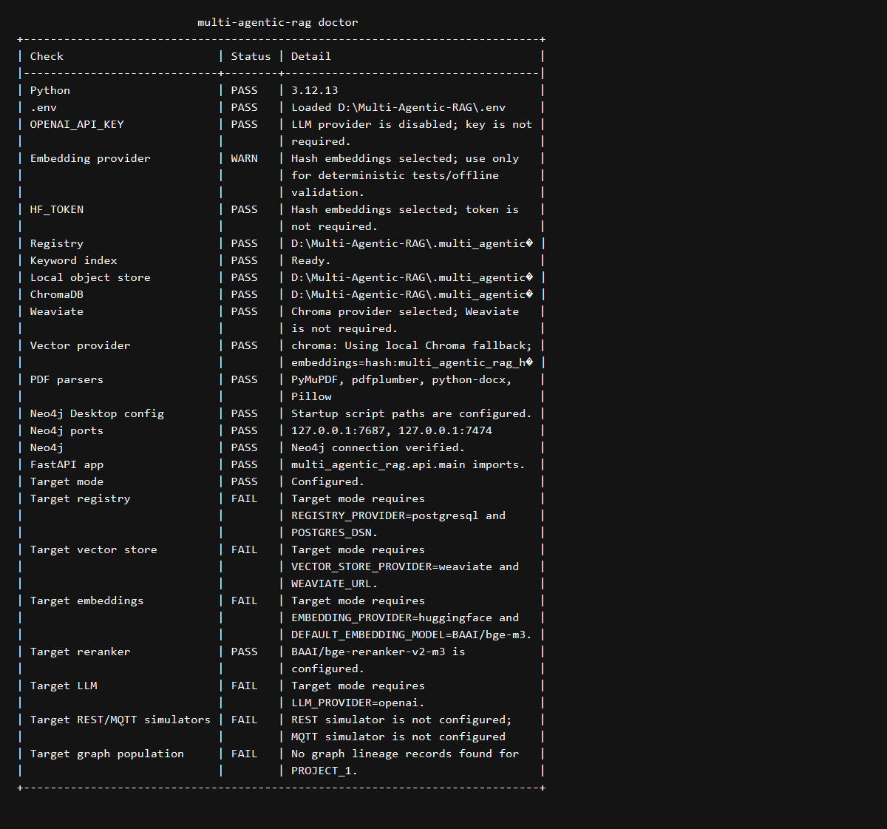
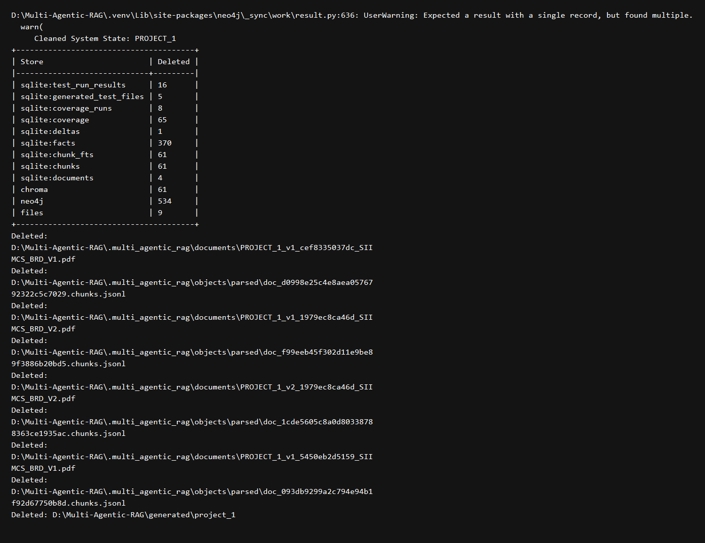
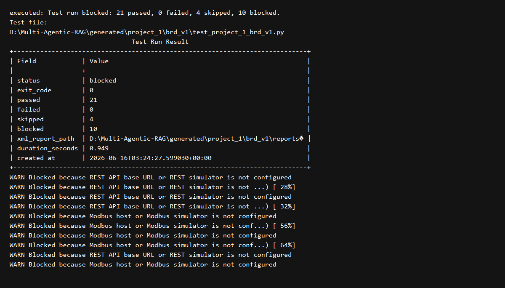
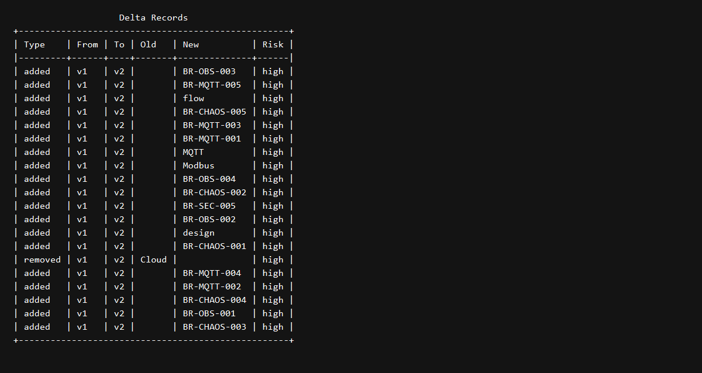
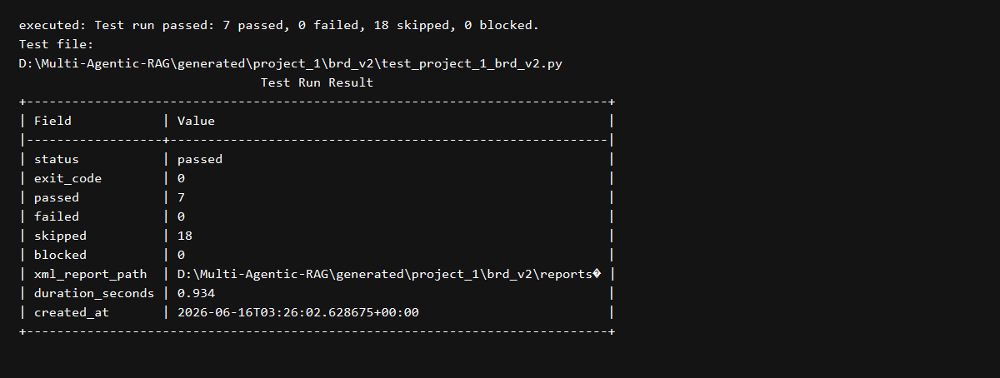

# First Run Report Summary

Generated on `2026-06-16` for `PROJECT_1` in `D:\Multi-Agentic-RAG`.

## Scope

This run exercised the current framework against the real files in `documents/inbox/PROJECT_1/`:

- `SIIMCS_BRD_V1.pdf`
- `SIIMCS_BRD_V2.pdf`

The requested lifecycle was executed in this order:

1. Runtime readiness check.
2. Scoped cleanup of prior `PROJECT_1` runtime state.
3. V1 ingest.
4. V1 coverage planning for `25` scenarios.
5. V1 test generation.
6. V1 testcase execution.
7. V2 ingest.
8. V1 -> V2 delta analysis.
9. V2 coverage planning for `25` scenarios.
10. V2 test regeneration and selective execution.

## Runtime Mode Used

The checked-in `.env` is currently configured for strict target-mode expectations, but the live local machine is still using local development providers. Because of that, strict `doctor` fails for target registry/vector/LLM readiness even though the local stack is usable.

For this first-run validation, the commands were executed with explicit local-dev overrides:

```powershell
$env:ALLOW_LOCAL_DEV_MODE='true'
$env:REGISTRY_PROVIDER='sqlite'
$env:VECTOR_STORE_PROVIDER='chroma'
$env:EMBEDDING_PROVIDER='hash'
$env:LLM_PROVIDER='none'
$env:GRAPHRAG_REQUIRED='false'
```

That produced a usable local execution mode with:

- SQLite registry
- Chroma vector store
- Hash embeddings
- Neo4j graph connectivity available
- LLM disabled

## Screenshots

### 1. Local doctor output



### 2. Scoped cleanup output



### 3. V1 execution outcome



### 4. V1 to V2 delta output



### 5. V2 selective execution outcome



## What Happened

### Readiness and cleanup

- `doctor` passed for the local stack and confirmed Neo4j connectivity.
- The same `doctor` output also showed that the checked-in target-mode expectations are still not satisfied for PostgreSQL, Weaviate, HuggingFace embeddings, OpenAI, and simulators.
- `clean-system-state --system PROJECT_1 --yes` removed prior `PROJECT_1` data from SQLite, Chroma, Neo4j, parsed-object storage, and `generated/project_1`.

Cleanup removed:

- `16` prior test run result rows
- `5` generated test file rows
- `8` coverage runs
- `65` coverage rows
- `1` prior delta row
- `370` fact rows
- `61` chunks
- `4` documents
- `534` Neo4j nodes/relationships matched through the scoped cleanup path

### V1 ingest -> plan -> generate -> execute

V1 ingest result:

- Document ID: `doc_093db9299a2c794e94b1f92d67750b8d`
- Status: `active`
- Chunks indexed: `14`
- Facts extracted: `85`
- Deltas created: `0`
- Neo4j available: `True`

V1 planning/generation result:

- Coverage run ID: `coverage_run_91fef28475f05cd176a0781b9848a637`
- Scope hash: `scope_8e715b8a007ed2094cbe6829669ecd1e`
- Generated scenarios: `25`
- Planning source: Neo4j graph-backed requirement evidence

V1 generated artifacts:

- `generated/project_1/brd_v1/test_project_1_brd_v1.py`
- `generated/project_1/brd_v1/test_project_1_brd_v1.json`
- `generated/project_1/brd_v1/test_project_1_brd_v1.robot`
- `generated/project_1/brd_v1/conftest.py`
- `generated/project_1/brd_v1/pytest.ini`
- `generated/project_1/brd_v1/reports/coverage.json`
- `generated/project_1/brd_v1/reports/run_20260616T032426647279Z.xml`

V1 execution result:

- CLI status: `blocked`
- Passed: `21`
- Failed: `0`
- Skipped: `4`
- Blocked: `10`
- JUnit XML test count: `25`

Observed blocker types in V1:

- `REST API base URL or REST simulator is not configured`
- `Modbus host or Modbus simulator is not configured`

Interpretation:

- The framework generated `25` tests successfully.
- `21` scenarios executed as document-contract validations and passed.
- The protocol-bound scenarios were intentionally not faked and were skipped/blocked because no real REST or Modbus dependency was configured.

### V2 ingest -> delta -> selective coverage -> selective execution

V2 ingest result:

- Document ID: `doc_1848db05663269744a8b86411b2bc51a`
- Status: `active`
- Chunks indexed: `21`
- Facts extracted: `116`
- Deltas created: `20`
- Neo4j available: `True`

After V2 ingest, V1 was marked `superseded` and V2 was marked `active`.

Delta result:

- Total delta rows: `20`
- `19` `added`
- `1` `removed`
- `0` `modified`
- All `20` rows were marked `high` risk by the current delta model

Representative V2 additions:

- `BR-CHAOS-001` through `BR-CHAOS-005`
- `BR-MQTT-001` through `BR-MQTT-005`
- `BR-OBS-001` through `BR-OBS-004`
- `protocol:mqtt`
- `device:modbus`
- `sensor:flow`

Representative removal:

- `Cloud`

V2 planning/generation result:

- Coverage run ID: `coverage_run_0f33da0591a5ddd93790c075e9d1d765`
- Scope hash: `scope_9cdd9cba7b454d9f00c1c3f790039bf9`
- Generated scenarios: `25`
- Reused coverage: `18`
- Updated coverage: `7`

This is the key lifecycle behavior you asked for:

- Unchanged V1-linked coverage was reused.
- Only changed/new V2 coverage was marked for update.
- The generated sidecar records this explicitly in `coverage.reused_coverage` and `coverage.updated_coverage`.

V2 generated artifacts:

- `generated/project_1/brd_v2/test_project_1_brd_v2.py`
- `generated/project_1/brd_v2/test_project_1_brd_v2.json`
- `generated/project_1/brd_v2/test_project_1_brd_v2.robot`
- `generated/project_1/brd_v2/conftest.py`
- `generated/project_1/brd_v2/pytest.ini`
- `generated/project_1/brd_v2/reports/coverage.json`
- `generated/project_1/brd_v2/reports/run_20260616T032601694038Z.xml`

V2 execution result:

- CLI status: `passed`
- Passed: `7`
- Failed: `0`
- Skipped: `18`
- Blocked: `0`

Interpretation:

- The `18` unchanged scenarios were skipped by design with the message `Skipped unchanged scenario already covered by previous version`.
- The `7` changed/new scenarios were regenerated and executed.
- Those `7` scenarios passed because they were document-contract validations and did not require a live external dependency.

## Framework Capabilities Demonstrated

This run exercised the following framework capabilities end to end:

- `doctor` readiness auditing
- `clean-system-state` scoped reset
- versioned document ingest
- fact extraction and parsed artifact persistence
- graph-backed requirement selection via Neo4j
- local SQLite + Chroma execution fallback
- delta detection between V1 and V2
- coverage planning for `25` scenarios
- generated pytest, Robot wrapper, JSON sidecar, and coverage report creation
- testcase execution with stored run history and JUnit XML
- selective V2 reuse of unchanged coverage
- selective V2 regeneration of changed/new coverage
- `last-results` retrieval from persisted execution records

## Generated Artifact Inventory

Top-level generated outputs created by this run:

- `generated/project_1/brd_v1/`
- `generated/project_1/brd_v2/`
- `generated/first-run-report/logs/`
- `generated/first-run-report/screenshots/`

Important files:

- V1 sidecar: `generated/project_1/brd_v1/test_project_1_brd_v1.json`
- V2 sidecar: `generated/project_1/brd_v2/test_project_1_brd_v2.json`
- V1 coverage report: `generated/project_1/brd_v1/reports/coverage.json`
- V2 coverage report: `generated/project_1/brd_v2/reports/coverage.json`
- V1 JUnit XML: `generated/project_1/brd_v1/reports/run_20260616T032426647279Z.xml`
- V2 JUnit XML: `generated/project_1/brd_v2/reports/run_20260616T032601694038Z.xml`

## Blockers and Observations

### 1. Strict target-mode config is still not runnable on this machine

The repo currently expects strict target-mode dependencies in `.env`, but the actual machine is still operating in local-dev style. That is why strict `doctor` fails while the local override run succeeds.

### 2. V1 blocker accounting is noisier than the JUnit truth

For V1, the CLI summary reported `10 blocked`, while the JUnit XML shows `4` skipped protocol-bound tests. The sidecar `run_history.dependency_blockers` captured repeated warning fragments from stdout parsing, so the blocked count is inflated relative to unique blocked scenarios.

This looks like a reporting-quality issue in the execution summary path rather than a generation failure.

### 3. V2 dependency audit remained blocked even though the run passed

The V2 sidecar still reports a blocked dependency audit because the whole generated suite contains REST, MQTT, and Modbus expectations. But the actual executed subset passed because only the `7` changed/new scenarios ran, and those were document-contract style validations.

That behavior is coherent, but it means sidecar dependency status reflects the full generated suite while execution results reflect only the selected changed subset.

### 4. Initial orchestration race was operator-side, not repo-side

An earlier attempt launched ingest and downstream commands in parallel, which caused coverage and delta reads to occur before ingest had committed data. The final recorded results in this report are from the corrected sequential run.

## Final Outcome

The requested first-run lifecycle was completed successfully in the current framework:

- V1 was ingested and covered with `25` generated scenarios.
- V1 execution surfaced real missing-interface blockers instead of faking integration success.
- V2 was ingested and delta analysis detected `20` fact changes.
- V2 coverage reused `18` unchanged scenarios and regenerated `7` changed/new ones.
- V2 execution skipped unchanged prior coverage and ran only the changed subset.
- All artifacts and this report were published under `generated/`.

## Log Files

Saved command logs used for this report:

- `generated/first-run-report/logs/01_doctor_local_v1.txt`
- `generated/first-run-report/logs/02_clean_project1.txt`
- `generated/first-run-report/logs/03_ingest_v1.txt`
- `generated/first-run-report/logs/04_coverage_v1.txt`
- `generated/first-run-report/logs/05_generate_v1.txt`
- `generated/first-run-report/logs/06_run_v1.txt`
- `generated/first-run-report/logs/07_last_results_v1.txt`
- `generated/first-run-report/logs/08_ingest_v2.txt`
- `generated/first-run-report/logs/09_delta_v1_to_v2.txt`
- `generated/first-run-report/logs/10_coverage_v2.txt`
- `generated/first-run-report/logs/11_generate_v2.txt`
- `generated/first-run-report/logs/12_run_v2.txt`
- `generated/first-run-report/logs/13_last_results_v2.txt`
