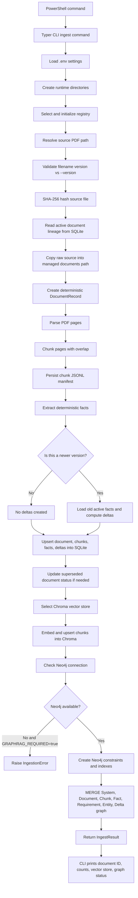
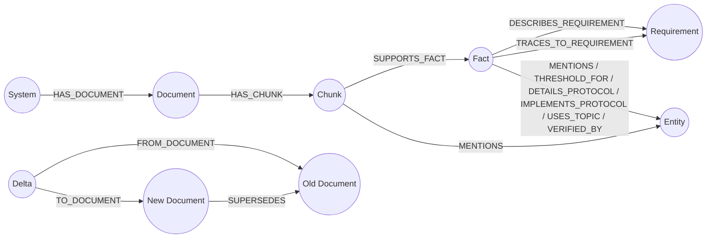
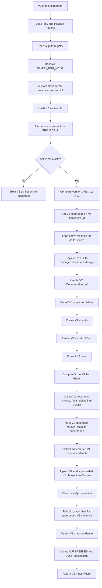
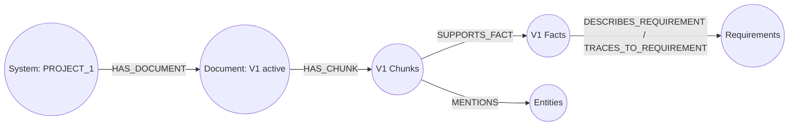
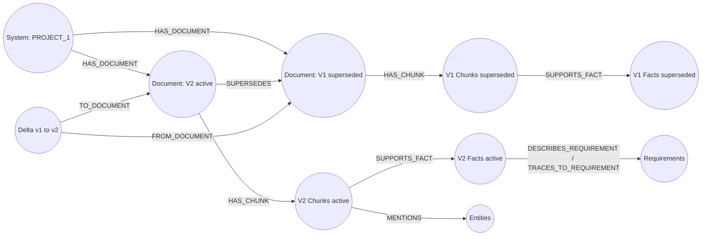

# Document Ingestion Deep Dive

This note explains what happens internally when you run:

```powershell
uv run multi-agentic-rag ingest documents/inbox/PROJECT_1/SIIMCS_BRD_V1.pdf --system PROJECT_1 --version v1
```

The command ingests one versioned BRD/SRS-style document into the local GraphRAG evidence layer:

- SQLite stores durable metadata, chunks, facts, deltas, coverage, and run state.
- ChromaDB stores chunk text and vector-search metadata.
- Neo4j stores the knowledge graph used by graph-backed retrieval and coverage planning.
- The local runtime keeps copied source documents under `.multi_agentic_rag/documents/`
  and parsed chunk manifests under `.multi_agentic_rag/objects/parsed/`.

The command does not run chat, coverage planning, test generation, or test execution by itself. It prepares the evidence layer those workflows use later.

This walkthrough assumes the normal lifecycle order: ingest V1 first, then ingest V2. If V2 is already active and you rerun the V1 command, the code correctly stores V1 as superseded historical evidence instead of making it active again.

## Required Runtime State

For the current local setup, the important `.env` shape is:

```dotenv
MULTI_AGENTIC_RAG_PROFILE=local
MARAG_TARGET_MODE=local
ALLOW_LOCAL_DEV_MODE=true

REGISTRY_PROVIDER=sqlite
SQLITE_DB_PATH=.multi_agentic_rag/registry.db
OBJECT_STORE_PATH=.multi_agentic_rag/objects

VECTOR_STORE_PROVIDER=chroma
CHROMA_PATH=.multi_agentic_rag/chroma

GRAPHRAG_REQUIRED=true
NEO4J_URI=bolt://127.0.0.1:7687
NEO4J_USERNAME=neo4j
NEO4J_PASSWORD=<your Neo4j Desktop MRAG instance password>
NEO4J_DATABASE=neo4j

EMBEDDING_PROVIDER=huggingface
DEFAULT_EMBEDDING_MODEL=BAAI/bge-m3
HF_TOKEN=<optional, if required by your Hugging Face access>
```

Because `GRAPHRAG_REQUIRED=true`, Neo4j is mandatory. If Neo4j is stopped or authentication fails, ingestion raises an `IngestionError` from the graph-build step rather than silently skipping graph creation. Earlier SQLite, Chroma, and parsed-artifact writes may already have happened, so rerun the same ingest command after fixing Neo4j or clean the system state before rebuilding.

Before ingestion, run:

```powershell
uv run multi-agentic-rag doctor --system PROJECT_1 --version v1
uv run multi-agentic-rag graph-check
```

## Workflow Diagram



## Bit-By-Bit Internal Mechanism

### 1. `uv run` launches the project CLI

`uv run` executes the console script from the project environment. The script name `multi-agentic-rag` resolves to:

```text
multi_agentic_rag.cli:app
```

The CLI is a Typer app. The `ingest` command receives:

- `path`: `documents/inbox/PROJECT_1/SIIMCS_BRD_V1.pdf`
- `--system`: `PROJECT_1`
- `--version`: `v1`

The CLI then calls:

```python
ingest_document(path, system_name=system, version=version)
```

### 2. Settings are loaded from `.env`

`get_settings()` reads `.env` through `pydantic-settings`. These settings decide:

- whether local file-backed providers are allowed;
- which metadata registry to use;
- which vector store to use;
- where runtime directories live;
- whether Neo4j graph writes are mandatory;
- which embedding model Chroma uses.

For this project mode:

- `REGISTRY_PROVIDER=sqlite` selects `SQLiteRegistry`.
- `VECTOR_STORE_PROVIDER=chroma` selects `ChromaVectorStore`.
- `GRAPHRAG_REQUIRED=true` makes Neo4j graph creation mandatory.
- `EMBEDDING_PROVIDER=huggingface` selects `BAAI/bge-m3` embeddings.

### 3. Runtime directories are created

`ensure_runtime_dirs(settings)` creates local runtime folders:

```text
.multi_agentic_rag/
.multi_agentic_rag/documents/
.multi_agentic_rag/exports/
.multi_agentic_rag/objects/
.multi_agentic_rag/chroma/
```

It also ensures the parent folder for:

```text
.multi_agentic_rag/registry.db
```

The source document remains in `documents/inbox/...`; ingestion copies it into managed runtime storage for traceability.

### 4. SQLite registry is selected and initialized

`select_registry(settings)` returns `SQLiteRegistry` when `REGISTRY_PROVIDER=sqlite`.

SQLite is allowed only when:

```dotenv
ALLOW_LOCAL_DEV_MODE=true
```

The registry initializes tables and indexes if they do not already exist. The important ingestion tables are:

- `documents`
- `chunks`
- `facts`
- `deltas`
- `chunk_fts`, an FTS5 keyword-search index

The same registry also contains later workflow tables such as `coverage`, `coverage_runs`, `generated_test_files`, and `test_run_results`.

### 5. The source path is resolved

`resolve_path(source_path)` converts the command argument into an absolute path.

If the file does not exist, ingestion stops with:

```text
Document does not exist: <path>
```

Supported document types are:

- `.pdf`
- `.docx`

For this command, the parser path is PDF.

### 6. The filename version is validated

The ingestion layer checks whether the filename itself suggests a version.

For:

```text
SIIMCS_BRD_V1.pdf
```

the inferred filename version is:

```text
v1
```

That is compared with:

```text
--version v1
```

If the filename says `V1` but the command says `--version v2`, ingestion stops. This prevents accidental lineage corruption where a V1 document is stored as V2.

### 7. The source file hash is computed

`sha256_file(source)` creates a SHA-256 content hash for the PDF.

That hash is used for:

- stable document identity;
- managed copied filename;
- detecting and tracing source content;
- creating repeatable IDs.

### 8. Existing active document lineage is read

The registry checks:

```python
registry.list_documents(system_name="PROJECT_1", status=DocumentStatus.ACTIVE)
registry.get_active_document("PROJECT_1")
```

If no active document exists for `PROJECT_1`, the new document becomes the first active version.

If an active document exists and the new version is newer, ingestion prepares to:

- mark the old active document as superseded;
- compute fact-level deltas;
- create `SUPERSEDES` relationships in Neo4j.

If the new version is older than the active document, the new record is stored as superseded instead of active.

Version ordering is numeric when digits exist. Examples:

- `v2` is newer than `v1`
- `v10` is newer than `v2`

### 9. The raw document is copied into managed runtime storage

`LocalObjectStore.store_source_document(...)` copies the original PDF into:

```text
.multi_agentic_rag/documents/
```

The copied filename includes:

- system name;
- version;
- first 12 characters of the content hash;
- original source filename.

The copy is used as the durable source artifact path in the `documents` table. Parsed chunk manifests are stored separately under the local object-store path.

### 10. A deterministic `DocumentRecord` is created

`create_document_record(...)` creates a `DocumentRecord` with:

- `document_id`
- `system_name`
- `version`
- `status`
- `source_path`
- `source_name`
- `content_hash`
- `created_at`
- optional `supersedes`
- optional `superseded_by`

The `document_id` is deterministic:

```text
doc_<stable hash of system, version, source name, content hash>
```

This is why repeated ingestion of the same file/version is idempotent at the record-ID level.

### 11. PDF pages are parsed

For PDF files, `load_pdf_pages(...)` uses:

- PyMuPDF as the primary page text parser;
- pdfplumber to extract table text and append it to page text;
- optional Tesseract OCR only when `ENABLE_PDF_OCR=true` and a page has no extractable text.

Each extracted page becomes a `PageText` object:

```python
PageText(
    page=<page number>,
    text=<page text plus table text>,
    tables=<table text list>,
    extraction_method="pymupdf" | "tesseract"
)
```

If no page has extractable text, ingestion stops.

### 12. Pages are split into chunks

`chunk_pages(...)` splits each page using `RecursiveCharacterTextSplitter` when available.

Current defaults:

```text
DEFAULT_CHUNK_SIZE=1000
DEFAULT_CHUNK_OVERLAP=150
```

Separators are tried in this order:

```python
["\n\n", "\n", ". ", " ", ""]
```

Each chunk gets:

- page number;
- inferred section title from the first non-empty line;
- global chunk index;
- text content hash;
- stable chunk ID.

The chunk ID shape is:

```text
chunk_<stable hash of system, version, source name, page, chunk index, content hash>
```

### 13. Parsed chunks are written as JSONL

`LocalObjectStore.store_chunks(...)` writes one JSON object per chunk to:

```text
.multi_agentic_rag/objects/parsed/<document_id>.chunks.jsonl
```

This file is an audit and re-indexing artifact. It lets you inspect exactly which text chunks were produced from the source document.

### 14. Deterministic facts are extracted

For every chunk, `extract_facts_from_chunk(chunk)` runs rule-based extractors.

The current rule extractors look for:

- requirement IDs such as `REQ-1`, `BRD-1`, `SRS-1`, `API-1`, `UC-1`;
- threshold and limit facts for sensors;
- table-shaped threshold rows;
- protocols such as Modbus, MQTT, CAN, and REST;
- REST endpoints;
- CAN identifiers;
- Modbus registers/coils;
- sensor mentions;
- device mentions;
- MQTT topics;
- test case IDs.

Each extracted fact becomes a `FactRecord`:

```python
FactRecord(
    fact_id=<stable fact ID>,
    fact_key=<semantic fact key>,
    fact_type=<requirement | threshold | protocol | ...>,
    value=<normalized value>,
    unit=<optional unit>,
    document_id=<document ID>,
    chunk_id=<chunk ID>,
    system_name="PROJECT_1",
    version="v1",
    status=<document status>,
    evidence=<source text window>,
    requirement_id=<nearest linked requirement, if known>,
    semantic_key=<fact key>,
    metadata=<extractor metadata>
)
```

The `evidence` field is always source-grounded text from the chunk.

### 15. Optional LLM fallback extraction may run

If:

```dotenv
LLM_PROVIDER != none
```

then ingestion tries to select an LLM client. It only uses the fallback when:

- the LLM client is ready;
- deterministic extraction found no facts for a chunk.

The fallback is constrained:

- it may extract only explicit engineering facts;
- every fact evidence field must be a verbatim substring of the chunk;
- facts with evidence not found in the chunk are rejected.

In your current local mode, `LLM_PROVIDER=none`, so this path is skipped.

### 16. Deltas are computed only for newer versions

For the V1 command, if no older active document exists, no deltas are created.

For a later V2 command, ingestion loads active V1 facts and calls:

```python
compute_fact_deltas(
    system_name="PROJECT_1",
    from_version="v1",
    to_version="v2",
    old_facts=<V1 facts>,
    new_facts=<V2 facts>,
)
```

Deltas are compared by stable fact key. The result can be:

- `added`
- `removed`
- `modified`

Each delta stores:

- old value;
- new value;
- affected requirement ID;
- risk level;
- evidence snippets.

### 17. SQLite records are written

Ingestion writes:

```python
registry.upsert_document(document)
registry.upsert_chunks(chunks)
registry.upsert_facts(facts)
registry.insert_deltas(deltas)
```

The writes are idempotent where primary keys exist. Re-running the same document updates the same document/chunk/fact rows rather than creating unrelated duplicate identities.

The chunk write also populates the SQLite FTS5 keyword index:

```text
chunk_fts
```

That supports keyword retrieval alongside vector and graph retrieval.

### 18. Superseded status is applied

When a newer version is ingested, old active document records are marked:

```text
status=superseded
superseded_by=<new document ID>
```

Their chunks and facts also get status updated to `superseded`.

This keeps V1 evidence available for history and delta analysis while allowing current queries to focus on active V2 truth.

### 19. Chroma vector indexing runs

`select_vector_store(settings)` chooses Chroma when:

```dotenv
VECTOR_STORE_PROVIDER=chroma
```

It also selects the embedding function:

- `huggingface` uses `BAAI/bge-m3` through `sentence-transformers`;
- `hash` is a deterministic fallback intended for tests/offline validation.

For each chunk, `ChromaVectorStore.index_chunks(...)` upserts:

- `id`: chunk ID;
- `document`: chunk text;
- `metadata`: document ID, system name, version, status, source name, page, section title, chunk index, content hash, embedding provider, embedding model.

The persistent Chroma path is:

```text
.multi_agentic_rag/chroma
```

The collection name is:

```text
multi_agentic_rag_chunks
```

If vector indexing fails, ingestion records a warning and returns `vector_store=unavailable`. Graph creation is still attempted afterward.

### 20. Neo4j connection is checked

`_build_graph_if_available(...)` creates `Neo4jGraphStore(settings)` and calls:

```python
graph_store.check_connection()
```

That verifies:

- `NEO4J_URI` is configured;
- localhost Neo4j is allowed because `ALLOW_LOCAL_DEV_MODE=true`;
- the Neo4j driver can connect using `NEO4J_USERNAME` and `NEO4J_PASSWORD`.

If Neo4j is unavailable and `GRAPHRAG_REQUIRED=true`, ingestion raises:

```text
Neo4j graph build skipped: <connection/auth/detail>
```

### 21. Neo4j constraints and indexes are created

Before graph writes, `build_basic_graph(...)` calls:

```python
graph_store.create_indexes()
```

This creates uniqueness constraints for:

- `System.system_name`
- `Document.document_id`
- `Chunk.chunk_id`
- `Requirement.requirement_id`
- `Fact.fact_id`
- `Entity.entity_id`
- `Delta.delta_id`
- coverage and test execution graph nodes used by later workflows

It also creates indexes for fact type, fact key, entity name/type, document status/version, chunk status/version, and fact status/version.

### 22. Neo4j graph nodes and relationships are merged

Graph writes are idempotent through Cypher `MERGE`.

The basic ingestion graph is:



For the first V1 ingest, expect:

- one `System` node for `PROJECT_1`;
- one `Document` node for the V1 PDF;
- one `Chunk` node per parsed chunk;
- `Fact` nodes for extracted facts;
- `Requirement` nodes when requirement facts or requirement-linked facts exist;
- typed `Entity` nodes for sensors, protocols, devices, topics, and test references;
- no `Delta` nodes unless there is already an older active version being superseded.

### 23. The CLI prints an `IngestResult`

The CLI prints:

- source file name;
- document ID;
- document status;
- chunk count;
- fact count;
- delta count;
- vector store provider;
- keyword index count;
- parsed chunk manifest path;
- whether Neo4j was available;
- warnings, if any.

## Files And Stores Touched

For the V1 command, expect writes under:

```text
.multi_agentic_rag/registry.db
.multi_agentic_rag/documents/
.multi_agentic_rag/objects/parsed/
.multi_agentic_rag/chroma/
```

And graph writes into:

```text
Neo4j database: neo4j
URI: bolt://127.0.0.1:7687
```

The original input file remains at:

```text
documents/inbox/PROJECT_1/SIIMCS_BRD_V1.pdf
```

## How To Verify After Ingestion

Run the ingest command:

```powershell
uv run multi-agentic-rag ingest documents/inbox/PROJECT_1/SIIMCS_BRD_V1.pdf --system PROJECT_1 --version v1
```

Check current documents in Neo4j Browser:

```cypher
MATCH (s:System {system_name: "PROJECT_1"})-[:HAS_DOCUMENT]->(d:Document)
RETURN s.system_name, d.document_id, d.source_name, d.version, d.status
ORDER BY d.version;
```

Check chunks and facts:

```cypher
MATCH (d:Document)-[:HAS_CHUNK]->(c:Chunk)-[:SUPPORTS_FACT]->(f:Fact)
WHERE d.system_name = "PROJECT_1"
RETURN d.version, c.page, c.chunk_index, f.fact_type, f.fact_key, f.value
LIMIT 50;
```

Check requirement graph:

```cypher
MATCH (f:Fact)-[:DESCRIBES_REQUIREMENT|TRACES_TO_REQUIREMENT]->(r:Requirement)
WHERE f.system_name = "PROJECT_1"
RETURN r.requirement_id, f.fact_type, f.fact_key, f.value
LIMIT 50;
```

Check entity graph:

```cypher
MATCH (c:Chunk)-[:MENTIONS]->(e:Entity)
WHERE e.system_name = "PROJECT_1"
RETURN e.entity_type, e.name, e.version
LIMIT 50;
```

Check the project retrieval path:

```powershell
uv run multi-agentic-rag query "What are the main requirements?" --system PROJECT_1 --version v1
```

## Common Failure Points

### Neo4j authentication failure

Symptom:

```text
Neo.ClientError.Security.Unauthorized
```

Cause:

```text
NEO4J_PASSWORD in .env does not match the Neo4j Desktop MRAG instance password.
```

Fix:

```dotenv
NEO4J_USERNAME=neo4j
NEO4J_PASSWORD=<exact Desktop instance password>
NEO4J_DATABASE=neo4j
```

Then run:

```powershell
uv run multi-agentic-rag graph-check
```

### Neo4j stopped

Symptom:

```text
Couldn't connect to 127.0.0.1:7687
```

Fix:

Start the `MRAG` instance in Neo4j Desktop, then verify:

```powershell
Test-NetConnection -ComputerName localhost -Port 7687
Test-NetConnection -ComputerName localhost -Port 7474
```

### Filename version mismatch

Symptom:

```text
Source filename suggests version v1, but --version was v2.
```

Fix:

Use the version that matches the file:

```powershell
uv run multi-agentic-rag ingest documents/inbox/PROJECT_1/SIIMCS_BRD_V1.pdf --system PROJECT_1 --version v1
```

### Hugging Face model download/cache issue

Symptom:

Vector indexing warning or embedding model loading error.

Fix:

Verify:

```dotenv
EMBEDDING_PROVIDER=huggingface
DEFAULT_EMBEDDING_MODEL=BAAI/bge-m3
HF_HOME=.cache/huggingface
HF_HUB_CACHE=.cache/huggingface/hub
```

If your network requires authentication for model access, set `HF_TOKEN`.

## What Changes When V2 Is Introduced

When you later run:

```powershell
uv run multi-agentic-rag ingest documents/inbox/PROJECT_1/SIIMCS_BRD_V2.pdf --system PROJECT_1 --version v2
```

the flow is the same, except:

1. The registry sees an existing active V1 document.
2. V2 is numerically newer than V1.
3. V1 facts are loaded before status changes.
4. V1 vs V2 deltas are computed by fact key.
5. V1 document, chunks, and facts are marked `superseded`.
6. V2 is stored as the active document.
7. Neo4j gets a `V2 -[:SUPERSEDES]-> V1` relationship.
8. Delta nodes link `FROM_DOCUMENT` V1 and `TO_DOCUMENT` V2.

After V2 ingestion, run:

```powershell
uv run multi-agentic-rag delta --system PROJECT_1 --from v1 --to v2
uv run multi-agentic-rag query "What changed between V1 and V2?" --system PROJECT_1 --version v2
```

## V2 Knowledge-Base Update Deep Dive

This section explains the internal behavior of:

```powershell
uv run multi-agentic-rag ingest documents/inbox/PROJECT_1/SIIMCS_BRD_V2.pdf --system PROJECT_1 --version v2
```

The V2 command is not a separate code path. It calls the same `ingest_document(...)` service, but the state already created by V1 changes the behavior. V2 ingestion becomes an update operation over an existing project evidence base.

The important difference is that V1 is already active for `PROJECT_1`. When V2 arrives, the pipeline treats V2 as the new active truth, preserves V1 as superseded history, computes fact-level deltas, refreshes vector evidence, and updates Neo4j graph lineage.

### V2 Update Workflow Diagram



### Knowledge-Base State Before V2

After a successful V1 ingestion, the local knowledge base should contain this conceptual state:



The same evidence also exists in non-graph stores:

- SQLite has `documents`, `chunks`, `facts`, and `chunk_fts` rows for V1.
- Chroma has V1 chunk vectors and metadata.
- `.multi_agentic_rag/documents/` has the copied V1 source, and `.multi_agentic_rag/objects/parsed/` has the V1 chunk JSONL.

### Step 1: The CLI enters the same ingestion service

The Typer CLI still calls:

```python
ingest_document(path, system_name="PROJECT_1", version="v2")
```

There is no special `ingest_v2` command. Version behavior emerges from the stored document lineage in SQLite.

### Step 2: Runtime and provider setup is repeated

Just like V1, ingestion:

1. Loads `.env`.
2. Creates runtime directories.
3. Selects `SQLiteRegistry`.
4. Initializes SQLite tables and FTS index if needed.
5. Resolves the source file path.

These steps are idempotent. Existing runtime folders and existing SQLite tables are reused.

### Step 3: The source filename is checked against `--version v2`

For:

```text
SIIMCS_BRD_V2.pdf
```

the filename suggests:

```text
v2
```

That matches:

```text
--version v2
```

If you accidentally run:

```powershell
uv run multi-agentic-rag ingest documents/inbox/PROJECT_1/SIIMCS_BRD_V2.pdf --system PROJECT_1 --version v1
```

ingestion stops before writing new evidence, because the filename and command version disagree.

### Step 4: Existing active V1 is discovered

The service reads the current project lineage:

```python
active_documents = registry.list_documents(
    system_name="PROJECT_1",
    status=DocumentStatus.ACTIVE,
)
active_document = registry.get_active_document("PROJECT_1")
```

If V1 is currently active, `active_document.version` is:

```text
v1
```

The service compares:

```text
candidate = v2
current = v1
```

The version sort key extracts numbers, so:

```text
v2 > v1
```

V2 is therefore treated as the new active document.

### Step 5: V2 lineage is prepared

Because V2 is newer, ingestion sets:

```python
supersedes = active_document.document_id
delta_source_documents = [active_document]
```

That means the new V2 `DocumentRecord` will point back to the V1 document it supersedes.

At this moment, V1 is not marked superseded yet. The service first needs V1 active facts for delta computation.

### Step 6: V1 facts are loaded for comparison

Before changing V1 status, ingestion collects facts from V1:

```python
registry.list_facts(
    document_id=<v1 document_id>,
    status=DocumentStatus.ACTIVE,
)
```

These facts become the old side of the comparison.

The comparison is fact-key based, not chunk-position based. That is important because chunks may move between V1 and V2, but facts with the same semantic key can still be compared.

### Step 7: V2 source is copied into managed storage

The V2 PDF is copied into:

```text
.multi_agentic_rag/documents/
```

The destination filename includes:

- `PROJECT_1`
- `v2`
- the first 12 characters of the V2 content hash
- the original source filename

This preserves both the original inbox document and the managed source artifact.

### Step 8: V2 `DocumentRecord` is created

The new V2 document gets a stable ID based on:

- system name;
- version;
- source name;
- V2 content hash.

Conceptually:

```text
doc_<hash(PROJECT_1, v2, SIIMCS_BRD_V2.pdf, V2 content hash)>
```

The V2 document initially has:

```text
status=active
supersedes=<V1 document_id>
superseded_by=null
```

### Step 9: V2 pages, chunks, and chunk manifest are created

V2 parsing follows the same PDF path:

- PyMuPDF extracts page text.
- pdfplumber appends table text where possible.
- optional OCR only runs if enabled and needed.

Then the page text is split into chunks with:

```text
DEFAULT_CHUNK_SIZE=1000
DEFAULT_CHUNK_OVERLAP=150
```

Each V2 chunk gets:

- a deterministic `chunk_id`;
- V2 document ID;
- system name `PROJECT_1`;
- version `v2`;
- status `active`;
- page number;
- chunk index;
- content hash;
- chunk text.

The V2 chunk manifest is written to:

```text
.multi_agentic_rag/objects/parsed/<v2_document_id>.chunks.jsonl
```

### Step 10: V2 facts are extracted

Each V2 chunk runs through the deterministic extractors:

- requirements;
- thresholds;
- threshold table rows;
- protocols;
- protocol details;
- sensors;
- devices;
- MQTT topics;
- test IDs.

Each V2 fact gets:

```text
status=active
version=v2
document_id=<v2 document_id>
chunk_id=<v2 chunk id>
semantic_key=<fact_key>
```

The `semantic_key`/`fact_key` is what allows V1 and V2 facts to be compared even when their chunk IDs differ.

### Step 11: V1 vs V2 deltas are computed

The delta service receives:

```python
old_facts=<active V1 facts>
new_facts=<new V2 facts>
from_version="v1"
to_version="v2"
```

It builds maps by:

```python
fact.semantic_key or fact.fact_key
```

Then it compares the union of all old and new keys.

The delta types are:

```text
added     = fact key exists only in V2
removed   = fact key exists only in V1
modified  = fact key exists in both but value/unit changed
unchanged = fact key exists in both with same value/unit, so no delta row is created
```

Unchanged facts are deliberately omitted from the `deltas` table. This keeps the delta store focused on actual changes.

### Step 12: Delta magnitude and risk are classified

For numeric value changes, the project classifies magnitude by ratio:

```text
>= 20% change  -> major
>= 5% change   -> moderate
< 5% change    -> minor
```

For non-numeric changes:

```text
same value      -> minor
different value -> major
```

Risk is conservative:

- added or removed facts are `high`;
- threshold changes with major/moderate magnitude are `high`;
- minor changes are `low`;
- other changes default to `medium`.

Each `DeltaRecord` stores:

- `delta_id`;
- `system_name`;
- `from_version`;
- `to_version`;
- `fact_key`;
- `change_type`;
- `change_magnitude`;
- `old_value`;
- `new_value`;
- `affected_requirement_id`;
- `risk_level`;
- evidence snippets from V1 and/or V2.

### Step 13: SQLite writes the new active evidence

The service writes the new V2 evidence first:

```python
registry.upsert_document(v2_document)
registry.upsert_chunks(v2_chunks)
registry.upsert_facts(v2_facts)
registry.insert_deltas(v1_to_v2_deltas)
```

At this point SQLite has both V1 and V2 data, but V1 may still be active for a moment inside the transaction sequence.

### Step 14: SQLite marks V1 as superseded

After V2 and deltas are written, ingestion updates the previous active document:

```python
registry.update_document_status(
    v1_document_id,
    DocumentStatus.SUPERSEDED,
    superseded_by=v2_document_id,
)
```

This updates:

- the V1 row in `documents`;
- V1 rows in `chunks`;
- V1 rows in `facts`;
- V1 rows in `chunk_fts`, when the FTS table is available.

The resulting SQLite truth is:

```text
V2 document: active
V2 chunks: active
V2 facts: active
V1 document: superseded
V1 chunks: superseded
V1 facts: superseded
Delta rows: v1 -> v2
```

### Step 15: Superseded V1 evidence is collected for graph refresh

After status update, the service fetches:

```python
registry.get_document(v1_document_id)
registry.list_chunks(document_id=v1_document_id)
registry.list_facts(document_id=v1_document_id)
```

This gives the graph writer V1 evidence with updated `superseded` status.

That matters because Neo4j should not keep V1 graph nodes marked as active after V2 becomes active.

### Step 16: Chroma is refreshed with V2 and superseded V1 chunks

The vector indexing call receives:

```python
chunks + superseded_chunks
```

For V2 ingestion, this means:

- V2 active chunks are upserted into Chroma;
- V1 superseded chunks are also upserted so their metadata status changes from `active` to `superseded`.

This is an important subtlety. Chroma does not only receive V2 chunks. It also receives updated V1 chunks so vector metadata stays aligned with SQLite lineage.

After this step, Chroma can support:

- active V2 retrieval;
- historical V1 retrieval if a later workflow asks for older evidence;
- status-aware filtering by metadata.

### Step 17: Neo4j connectivity is mandatory

Before graph writes, ingestion checks Neo4j:

```python
graph_store.check_connection()
```

Because:

```dotenv
GRAPHRAG_REQUIRED=true
```

Neo4j failure is a hard blocker.

If the password is wrong, the DB is stopped, or the database name is wrong, V2 ingestion raises an `IngestionError`. Earlier SQLite, Chroma, or parsed-artifact writes may already exist, but the command is still considered failed because the mandatory graph knowledge base was not updated.

### Step 18: Neo4j constraints and indexes are ensured

For both superseded V1 and active V2 graph writes, ingestion calls:

```python
build_basic_graph(...)
```

That calls:

```python
graph_store.create_indexes()
```

The constraints are idempotent because Neo4j uses:

```cypher
CREATE CONSTRAINT ... IF NOT EXISTS
CREATE INDEX ... IF NOT EXISTS
```

Running V1 and V2 ingestion repeatedly should not duplicate graph constraints.

### Step 19: Neo4j refreshes superseded V1 graph state

Before writing V2, the service re-writes the superseded V1 document graph:

```python
build_basic_graph(
    graph_store,
    document=<V1 superseded document>,
    chunks=<V1 superseded chunks>,
    facts=<V1 superseded facts>,
    deltas=[],
)
```

Because graph writes use `MERGE`, existing V1 nodes are updated rather than duplicated.

V1 graph nodes receive:

```text
Document.status = superseded
Chunk.status = superseded
Fact.status = superseded
Requirement.status = superseded, where requirement facts are re-merged
Entity.status = superseded, where entity facts are re-merged
```

### Step 20: Neo4j writes active V2 graph state

Then the service writes V2:

```python
build_basic_graph(
    graph_store,
    document=<V2 active document>,
    chunks=<V2 active chunks>,
    facts=<V2 active facts>,
    deltas=<V1-to-V2 deltas>,
)
```

This creates or updates:

- `System {system_name: "PROJECT_1"}`
- `Document {document_id: <v2 document id>}`
- `Chunk {chunk_id: <v2 chunk id>}`
- `Fact {fact_id: <v2 fact id>}`
- `Requirement {requirement_id: ...}`
- `Entity {entity_id: ...}`
- `Delta {delta_id: ...}`

### Step 21: Neo4j creates document lineage

Because V2 has:

```text
supersedes=<V1 document_id>
```

Neo4j creates:

```cypher
(v2:Document)-[:SUPERSEDES]->(v1:Document)
```

This is the core knowledge-base lineage relationship.

It lets later workflows understand that:

- V2 is current;
- V1 remains historical;
- V2 replaced V1 for the same system.

### Step 22: Neo4j creates delta lineage

For every computed delta, Neo4j creates:

```cypher
(delta:Delta)-[:FROM_DOCUMENT]->(v1:Document)
(delta:Delta)-[:TO_DOCUMENT]->(v2:Document)
```

The delta node stores:

- change type;
- magnitude;
- old value;
- new value;
- fact key;
- affected requirement;
- risk level.

This makes version change analysis graph-queryable.

### Step 23: Knowledge graph after V2

After V2 ingestion, the graph should look conceptually like this:



### Step 24: Knowledge-base store comparison after V2

After V2 ingestion, each store has a different role:

| Store | V1 state | V2 state | Delta state |
| --- | --- | --- | --- |
| SQLite `documents` | `superseded` | `active` | N/A |
| SQLite `chunks` | `superseded` | `active` | N/A |
| SQLite `facts` | `superseded` | `active` | N/A |
| SQLite `deltas` | referenced by `from_version` | referenced by `to_version` | stored rows |
| SQLite `chunk_fts` | searchable with superseded status | searchable with active status | N/A |
| Chroma | vectors retained with superseded metadata | vectors upserted with active metadata | N/A |
| Neo4j | historical graph nodes retained | active graph nodes created | `Delta` nodes linked V1 to V2 |
| Object store | V1 raw/chunk artifacts retained | V2 raw/chunk artifacts added | N/A |

### Step 25: CLI output for V2

The CLI prints the same fields as V1:

```text
Ingested SIIMCS_BRD_V2.pdf
Document ID: <v2 document id>
Status: active
Chunks indexed: <v2 chunk count>
Facts extracted: <v2 fact count>
Deltas created: <number of V1-to-V2 changes>
Vector store: chroma
Keyword indexed: <v2 chunk count>
Parsed artifact: .multi_agentic_rag/objects/parsed/<v2_document_id>.chunks.jsonl
Neo4j available: True
```

For V2, the key field is:

```text
Deltas created
```

If it is `0`, the code found no fact-level changes by semantic fact key. That does not necessarily mean the PDFs are byte-identical; it means the current deterministic facts did not differ.

### Step 26: Verify V2 update in SQLite through CLI

Use:

```powershell
uv run multi-agentic-rag delta --system PROJECT_1 --from v1 --to v2
```

Expected behavior:

- If delta rows exist, the CLI prints type/from/to/old/new/risk.
- If no delta rows exist, it prints that no impact claim can be made.

Then query active V2 evidence:

```powershell
uv run multi-agentic-rag query "What are the main requirements?" --system PROJECT_1 --version v2
```

### Step 27: Verify V2 update in Neo4j Browser

Check active and superseded documents:

```cypher
MATCH (s:System {system_name: "PROJECT_1"})-[:HAS_DOCUMENT]->(d:Document)
RETURN d.source_name, d.version, d.status, d.document_id
ORDER BY d.version;
```

Check lineage:

```cypher
MATCH (v2:Document)-[:SUPERSEDES]->(v1:Document)
WHERE v2.system_name = "PROJECT_1"
RETURN v2.version AS new_version, v2.status AS new_status,
       v1.version AS old_version, v1.status AS old_status;
```

Check deltas:

```cypher
MATCH (delta:Delta)-[:FROM_DOCUMENT]->(from_doc:Document),
      (delta)-[:TO_DOCUMENT]->(to_doc:Document)
WHERE delta.system_name = "PROJECT_1"
RETURN delta.fact_key,
       delta.change_type,
       delta.change_magnitude,
       delta.old_value,
       delta.new_value,
       delta.risk_level,
       from_doc.version,
       to_doc.version
ORDER BY delta.risk_level DESC
LIMIT 50;
```

Check active V2 facts:

```cypher
MATCH (d:Document {system_name: "PROJECT_1", version: "v2"})-[:HAS_CHUNK]->(c:Chunk)-[:SUPPORTS_FACT]->(f:Fact)
RETURN c.page, c.chunk_index, f.fact_type, f.fact_key, f.value, f.status
LIMIT 50;
```

Check superseded V1 facts:

```cypher
MATCH (d:Document {system_name: "PROJECT_1", version: "v1"})-[:HAS_CHUNK]->(c:Chunk)-[:SUPPORTS_FACT]->(f:Fact)
RETURN c.page, c.chunk_index, f.fact_type, f.fact_key, f.value, f.status
LIMIT 50;
```

### Step 28: Failure behavior during V2 ingestion

Because the V2 flow writes multiple stores, failures matter.

If Neo4j fails after SQLite/Chroma work has already begun, ingestion raises because graph evidence is mandatory. If that happens, fix Neo4j and either:

1. rerun the same V2 ingest command, or
2. clean the system state and rerun V1 then V2 in order.

The same V2 command is designed to be mostly idempotent because document IDs, chunk IDs, fact IDs, and delta IDs are stable hashes.

For a clean full rebuild:

```powershell
uv run multi-agentic-rag clean-system-state --system PROJECT_1 --yes --include-neo4j --include-generated
uv run multi-agentic-rag ingest documents/inbox/PROJECT_1/SIIMCS_BRD_V1.pdf --system PROJECT_1 --version v1
uv run multi-agentic-rag ingest documents/inbox/PROJECT_1/SIIMCS_BRD_V2.pdf --system PROJECT_1 --version v2
```

### V2 Mental Model

V1 ingestion creates the first truth set.

V2 ingestion performs a controlled replacement:

```text
V1 active evidence -> V1 superseded evidence
V2 new evidence -> V2 active evidence
V1 facts + V2 facts -> delta evidence
V1 document + V2 document -> graph lineage
```

The knowledge base does not forget V1. It reclassifies V1 as historical evidence, makes V2 the active evidence, and stores the difference between them as first-class delta records.

## Mental Model

Think of ingestion as a four-layer write:

1. Source artifact layer: copied PDF and parsed chunk JSONL.
2. Relational evidence layer: SQLite document, chunk, fact, delta, and keyword rows.
3. Vector evidence layer: Chroma embeddings and chunk metadata.
4. Graph evidence layer: Neo4j lineage, facts, requirements, entities, and deltas.

The graph layer is mandatory in this setup. If Neo4j is not ready, the RAG evidence base is considered incomplete.
